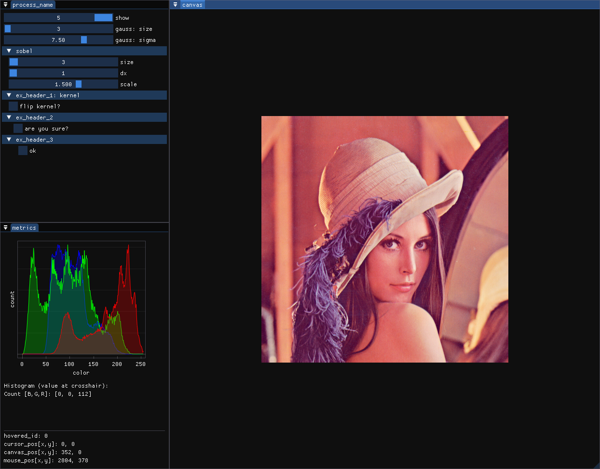

# cvdebug

Library designed for quickly debugging image processing pipelines and testing algorithms, visually. Focuses on ease of use for writing the code and injecting to already-existing codebases.

No performance hit if compiled with the correct flags (and not debugging).

All related code on how to use the tool effectively is contained within the main.cpp file.

Features:
- trackbar for easy parameter adjustments.
- step-by-step debugging of an image processing algorithm.
- histogram plots for easy analyzing.
- ROI snapshot for comparison and evaluation

All code is placed inside /src folder and should compile with no problem with C++17 and all the required libraries.

## Prerequisites

OpenCV 4.10.0 (no extra module compilation required, also 4.7.0+ should also work)

SDL2

OpenGL

fmt

## Running

### bear + make

bear -- make all

## Footnote

Thank you Dear ImGui for being awesome
